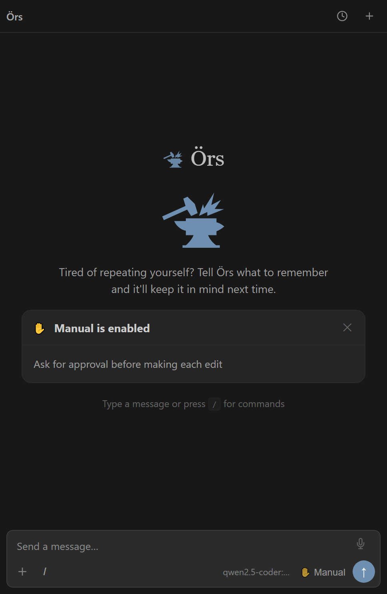
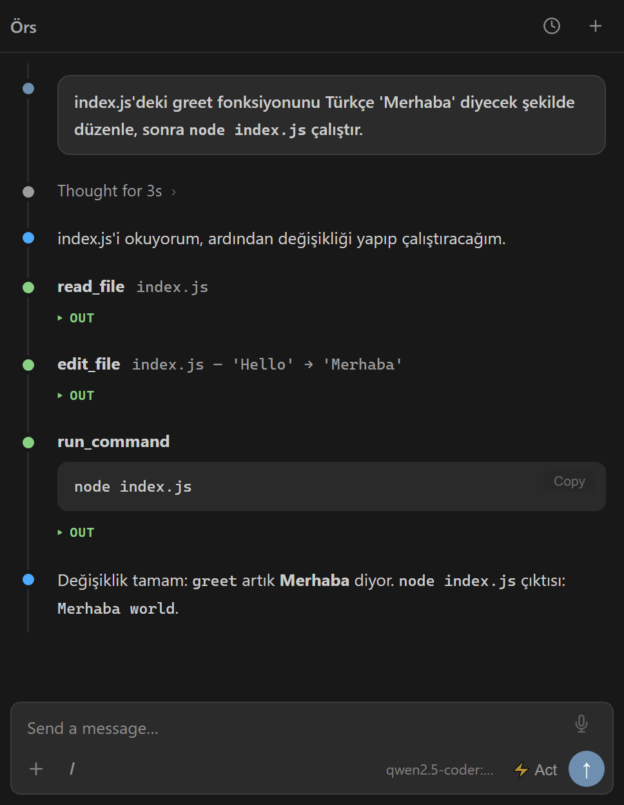
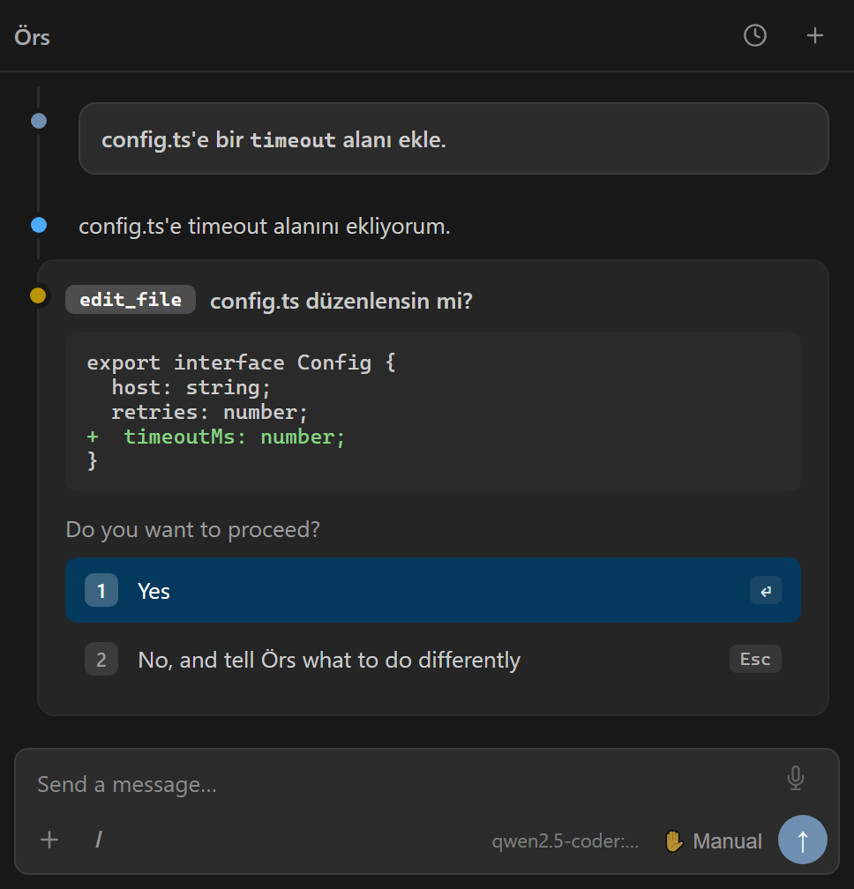

<div align="center">


# Örs — forge your code while the iron's hot

**Where code gets forged.** ("Örs" is Turkish for *anvil*.) A **general-purpose agentic
assistant** that runs on your own **local Ollama** models — reads and edits files inside
VSCode, runs commands, searches the web, connects to remote machines, and manages your
computer.

_chat → tool call → see the result → continue_ — it's entirely yours:
**no middle layer, no push to the cloud, no lock-in.**

</div>

---

## Screenshots

| Welcome | Agent session | Approval gate |
|:---:|:---:|:---:|
|  |  |  |
| Local model + persistent memory | Read → edit → run loop, live tool cards | Every write shown as a diff for approval |

---

## Why?

### What's wrong with the existing tools

The popular AI coding extensions (Cline, Continue, Copilot, etc.) nominally "support"
local models. But that support is mostly non-functional — and the issue isn't just that
they nudge you toward the cloud. The pattern is sharper: the local mode is left genuinely
too broken to use. This isn't inexperience or a one-off gap; it's an industry-wide choice.
Including the ones that call themselves "open source," these tools' revenue depends on
cloud API usage — a local mode that works well eats their own revenue. So local mode is
made to *look* supported while being kept unusable; the checkbox is ticked, the experience
is broken. Here's how that brokenness is built:

**Broken context management:**
Cline stuffs the project's entire file tree, every open file, and the whole conversation
history into the context for a single request. With cloud models this looks like "better
results" because there's a 200K-token window; on a local 7B model most of that context is
meaningless noise, the model loses its way, and quality collapses. The same extension works
well with GPT-4 and badly with Qwen — the difference isn't the model, it's the context
design.

**Tool-calling tied to the OpenAI format:**
Most tools do tool-calling via the `/v1/chat/completions` OpenAI format. You're forced to
run Ollama in "OpenAI-compatible" mode (`/v1` endpoint), where the proxy layer swallows
errors silently, streaming is inconsistent, and tool-call formats come back mismatched. You
spend hours debugging "why doesn't this work" with a local model.

**`num_ctx` never gets set:**
Ollama starts with a small context window by default. If a tool doesn't set it, Ollama
silently truncates — the model runs on half a conversation and reports no error. Cline and
Continue leave this to the user; most people can't figure out why the model is "acting
dumb."

**Weak or missing approval:**
With cloud models, "let the agent do everything automatically" is reasonable because you
trust the model's quality. A local 7B model sometimes overwrites a file with entirely wrong
content, or runs the wrong command — but the tool applies it directly, without a preview.
You only notice the mistake afterward.

**"Open source" ≠ local-first:**
Some of these tools genuinely are open source (Cline, Continue, Aider, Roo Code). But the
source being open doesn't mean the design is built for local models. The same pattern
holds: the architecture was set up for cloud frontier models from the start, and the local
model is an "option" bolted on later. Even Aider's docs recommend frontier models for best
results and build their leaderboard around them; local models sit at the bottom of the
list. Cline's forks (Roo Code, etc.) inherit the same context-stuffing architecture. The
result: you can read the code, but the tool still pushes you to the cloud. Open source is no
excuse for a bad local experience.

**Lock-in model:**
Cline's company (a cloud-API partner) and the company behind Continue make money from
subscriptions or API usage. Local-model support conflicts with these companies' core
revenue model. The tool "works" but doesn't work well — which eventually steers you back to
cloud frontier models.

### How Örs is different

Örs was designed for local models from the start. Cloud support isn't something to "add on"
later; on the contrary, you'd have to modify Örs to use a cloud model.

- **Native Ollama API** (`/api/chat`): no proxy, no format conversion, no OpenAI
  compatibility. It talks directly to Ollama's own tool-calling protocol.
- **`num_ctx` is sent explicitly**: `options.num_ctx` is set on every request, so Ollama
  can't truncate silently.
- **Deliberately restricted context**: only the active file and selection are added to the
  system prompt — not the whole project. Signal-to-noise ratio matters for a 7B model.
- **Every write and command previewed**: a diff viewer or the command text is shown;
  nothing is applied without approval. You can stop the model's mistake before you see it.
- **Weak-model fallback**: if the model can't produce tool calls in JSON, a separate parser
  extracts the tool call from free text. Weaker models work too.
- **Zero lock-in**: MIT-licensed, running on your own machine, with your own model, with no
  internet connection.

---

## Tools

| Tool | Description | Approval |
|------|-------------|----------|
| `read_file` | Read a file (with offset/limit for large files) | automatic |
| `write_file` | Create / overwrite a file | approval (diff) |
| `edit_file` | Section edit (unique text match) | approval (diff) |
| `list_dir` | List a directory | automatic |
| `search` | Grep across files | automatic |
| `glob` | Filename / path pattern matching | automatic |
| `get_diagnostics` | VSCode lint/compiler errors and warnings | automatic |
| `run_command` | Run a shell command (PowerShell/sh) | approval |
| `run_in_terminal` | Run a visible command in VSCode's integrated terminal | approval |
| `start_process` | Start a long-running background process | approval |
| `check_process` | Read a background process's output/status | automatic |
| `stop_process` | Stop a background process | approval |
| `ssh_run` | Run a command on a remote machine over SSH | approval |
| `web_search` | Web search via DuckDuckGo (8 results) | automatic |
| `web_fetch` | Fetch a web page and convert it to plain text | automatic |
| `describe_image` | Read/describe an image file with a vision model | automatic |
| `read_pdf` | Extract text from a PDF file | automatic |
| `spawn_agent` | Run a subtask in an independent sub-agent | approval |
| `connect_mcp` | Connect to an MCP server | approval |
| `call_mcp_tool` | Call a tool on a connected MCP server | approval |
| `schedule_task` | Schedule a task (cron / delay) | approval |
| `list_scheduled_tasks` | List active scheduled tasks | automatic |
| `cancel_task` | Cancel a scheduled task | approval |
| `ask_user` | Ask the user a structured question from within the agent loop | automatic |
| `manage_memory` | Add/read/delete notes that persist across sessions | automatic |
| `manage_todos` | Manage a task list (shown in the panel) | automatic |

**The approval policy** is customizable via settings: `ors.autoApprove`,
`ors.commandAllowlist`, `ors.commandDenylist`.

---

## Features

**Agentic loop**
Read → call a tool → see the result → continue. Native tool-calling, plus a text-format
fallback for weak models (including JSON repair). Repeating loops and consecutive failures
are detected and stopped automatically.

**Plan / Act mode**
In Plan mode the agent only has access to read tools, presents an implementation plan, and
doesn't touch files. In Act mode it applies the plan. Toggle with the ⚡/📋 button in the
panel.

**Task tracking**
For multi-step work the agent keeps a live to-do list via the `manage_todos` tool.
Completed items are checked off; the list is always visible in the panel sidebar.

**Native diff + undo**
File changes are presented for approval in VSCode's side-by-side diff editor. One click in
the panel undoes all changes from the last turn (checkpoint system).

**Context management**
In a long chat, the older part is summarized by the LLM and kept within the `num_ctx`
limit. The summary is added to the system prompt; earlier context isn't lost, only
compressed.

**Editor context**
The active file and selected code are added automatically. Use the `@relative/path` syntax
to add other files to the context.

**Persistent memory**
The `manage_memory` tool stores notes across projects; they're injected into the system
prompt at the start of each session. Write instructions like "always use TypeScript strict
mode in this project" once, and it always remembers.

**Command safety**
Safe commands on the allowlist (`git status`, `ls`, `npm test`…) run automatically; those
on the denylist (`rm`, `git push`, `shutdown`…) always require approval. Commands outside
the lists are evaluated by the default approval policy.

**Background processes**
Use `start_process` to start long-running commands like `npm run dev` or `docker compose up`
in the background. Watch the output with `check_process`, stop it with `stop_process`.

**Remote execution over SSH**
Run commands on other machines with `ssh_run`. Key-based authentication; no password
prompts.

**Web tools**
When the model wants to research a library it doesn't know, it searches DuckDuckGo with
`web_search`, then fetches and reads the relevant docs page with `web_fetch`.

**Multiple Ollama hosts**
Add several Ollama servers via settings or the command palette and switch between them —
a remote server for a powerful model, local for lightweight tasks.

**Diagnostics**
`get_diagnostics` reads VSCode's TypeScript/ESLint/Python errors and warnings directly. The
agent can see and fix compiler errors before you even save the file.

**Images and PDF**
`describe_image` reads a screenshot or diagram file with a vision model. `read_pdf` extracts
content from text-based PDFs.

**Sub-agent**
`spawn_agent` delegates long or divisible tasks to an independent sub-agent; the result
returns to the main agent while the session history stays clean.

**MCP (Model Context Protocol)**
Connect to an external MCP server with `connect_mcp`, use its tools with `call_mcp_tool`.
Extend capabilities by integrating your own or community MCP servers.

**Scheduled tasks**
Schedule tasks with a cron expression or delay via `schedule_task`. Track active schedules
with `list_scheduled_tasks`, cancel with `cancel_task`.

**Asking the user**
`ask_user` sends a structured, multiple-choice question from within the agent loop. The
agent waits until you choose, so critical decisions are opened up for approval.

**Slash commands**
`/test` · `/commit [note]` · `/explain [topic]` · `/fix [issue]` · `/review [focus]` · `/help`

---

## Installation

### From the prebuilt package (recommended)

A ready-to-use **`ors.vsix`** lives at the repository root. To install:

1. Download `ors.vsix` (from this repo).
2. VSCode → **Extensions** panel → the `···` menu (top right) → **Install from VSIX…** →
   select `ors.vsix`.
3. `Ctrl+Shift+P` → **Developer: Reload Window**.
4. The **Örs** icon appears in the left activity bar.

> Updating: when a new `ors.vsix` arrives, **Uninstall** the current version first, then
> reinstall (VSCode won't auto-refresh the same version).

Ollama must be running as a prerequisite — see the **Prerequisite: Ollama** section below.

### From source / development

```bash
npm install
npm run compile     # development build (sourcemaps)
npm run watch       # watch for changes + rebuild automatically
```

Open this folder in VSCode and press **F5** → an Extension Development Host window opens.

## Packaging

```bash
npm run package     # produces ors.vsix at the repo root (via vsce)
```

The resulting `ors.vsix` can be installed into any VSCode with the **Install from VSIX**
step above.

---

## Prerequisite: Ollama

1. Install it from [ollama.com](https://ollama.com) (or run it on another machine on your
   network).
2. Pull a model with tool-calling support:
   ```bash
   ollama pull qwen2.5-coder:7b
   # or
   ollama pull qwen3:8b
   ```
3. Start the server: `ollama serve` (defaults to `http://localhost:11434`).

If Ollama is on another machine: set **Settings → `ors.baseUrl`** to that address
(e.g. `http://192.168.1.50:11434`), or add a host via the command palette.

---

## Settings

| Setting | Default | Description |
|---------|---------|-------------|
| `ors.baseUrl` | `http://localhost:11434` | Active Ollama server address |
| `ors.hosts` | `["http://localhost:11434"]` | Registered host list |
| `ors.model` | `""` | Model name (also selectable from the panel) |
| `ors.temperature` | `0.2` | Sampling temperature |
| `ors.contextWindow` | `65536` | `num_ctx` — sent to Ollama on every request |
| `ors.maxIterations` | `25` | Max tool loops per request |
| `ors.workspaceOnly` | `false` | If `true`, the agent can't leave the workspace |
| `ors.autoApprove` | read/search/list: `true`; write/command: `false` | Category-based auto-approval |
| `ors.commandAllowlist` | `git status`, `ls`, `cat`, `npm test`… | Command prefixes that run without approval |
| `ors.commandDenylist` | `rm`, `git push`, `shutdown`… | Command prefixes that always require approval |

**`ors.workspaceOnly` note (security):** The default is `false`, meaning Örs runs as a
**general machine agent** and can reach anywhere on disk via absolute paths or `..`. This is
a deliberate choice (server management, multi-repo workflows). To confine the agent to the
open project, set it to `true` — then all file tools and `git_run` can't leave the root
directory (symlink escape is blocked too). If you're running an untrusted model or working
on a sensitive machine, `true` is recommended. In all cases, writes and commands are subject
to the approval gate.

**`ors.contextWindow` note:** Ollama starts with a small window by default and silently
truncates when it's exceeded. Örs sends `65536` by default (for larger models). Set this to
a value the model can actually handle — if you're constrained on memory/VRAM, lower it to
`32768` or `16384`. Whatever the value, it's sent as `options.num_ctx` on every request, so
Ollama can't truncate silently.

---

## Recommended models

Local models with strong tool-calling support:

| Model | Size | Note |
|-------|------|------|
| `qwen2.5-coder:7b` | ~5 GB | Most stable on coding tasks |
| `qwen2.5-coder:14b` | ~10 GB | Better reasoning, needs more RAM |
| `qwen3:8b` | ~6 GB | General purpose, strong tool-calling |
| `llama3.1:8b` | ~5 GB | Balanced; good on non-coding tasks |
| `mistral-small` | ~12 GB | Reliable at following instructions |

**Note:** use the `instruct` or `coder` variants, not the `base` models. Base models don't
recognize the instruction format and can't produce tool calls.

A small context window is the most common source of the "why doesn't this work" question —
keep `contextWindow` at least `16384` (default `65536`; `32768` if memory is tight).

---

## Architecture

```
src/
  llm/        LLMClient interface + OllamaClient (stream + native tool-calling)
  tools/      Tool interface + registry + tools + workspace security jail (optional)
  services/   ProcessManager · MemoryStore · TaskScheduler · MCPClient · ToolStats
  agent/      Agent loop + system prompt + context management + fallback parser
  webview/    WebviewViewProvider (UI bridge) + editor context + slash + native diff
  shared/     Typed host↔webview message contract
  edit/       Checkpoint system (undo)
  extension.ts  composition root — all dependencies are wired here
media/
  main.js     Webview client code (vanilla JS)
  style.css   Automatic theming via VSCode theme variables
```

Each layer depends only on the **interface** of the one below it. To swap Ollama for another
provider, you only need to implement the `LLMClient` interface; agent, tools, and webview
stay unchanged.

---

## License

MIT.

## Icons

- Welcome/wordmark anvil icon: [Lucide](https://lucide.dev) (ISC).
- Welcome mascot and the "working" indicator (anvil+hammer): "anvil-impact" — Lorc,
  [game-icons.net](https://game-icons.net), [CC BY 3.0](https://creativecommons.org/licenses/by/3.0/).
